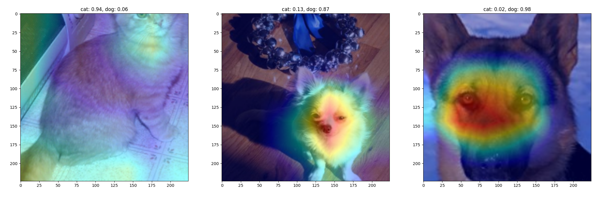
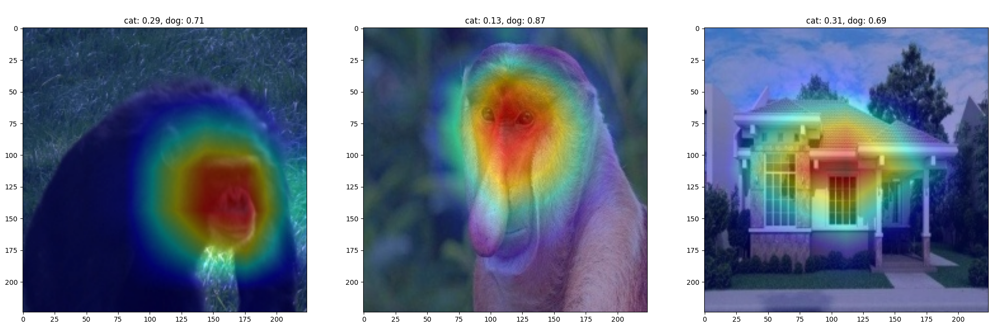
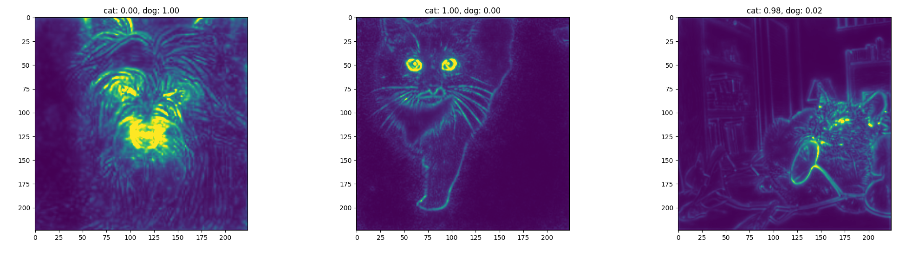
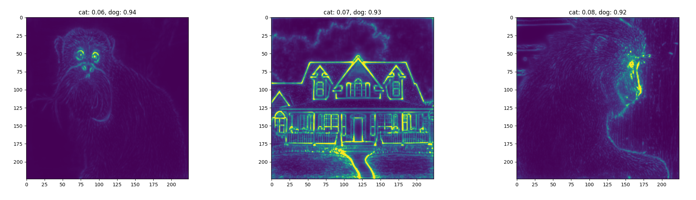

# Explainable AI for Data Outlier Detection

Essay ligger [her](./essay/essay.pdf).

## Overordnet mål

Utvikle en Out-of-Distribution detector som er inspirert av XAI. Bruk et datasett med kjente out of distribution punkter, kjør XAI OOD detector og state of the art OOD detectors og se om man får bedre resultater.

## Lesestoff

### Lest

- Selvaraju et Al. [*Grad-CAM: Visual Explanations from Deep Networks via Gradient-based Localization*](https://arxiv.org/pdf/1610.02391.pdf). (2019).
- Zhou et Al. [*Learning Deep Features for Discriminative Localization*](https://arxiv.org/pdf/1512.04150.pdf). (2015).
- Yang et Al. [*Generalized Out-of-Distribution Detection: A Survey*](https://arxiv.org/pdf/2110.11334.pdf). (2021).
- Velden et Al. [*Explainable artificial intelligence (XAI) in deep learning-based medical image analysis*](https://www.sciencedirect.com/science/article/pii/S1361841522001177#bib0252). (2022).
- Molnar, Cristoph. *Interpretable Machine Learning*. (2023).
- Borgli et Al. [*HyperKvasir, a comprehensive multi-class image and video dataset for gastrointestinal endoscopy*](https://www.nature.com/articles/s41597-020-00622-y). (2020).
- Hägele et Al. [*Resolving challenges in deep learning-based analyses of histopathological images using explanation methods*](https://www.nature.com/articles/s41598-020-62724-2.pdf). (2020).
- Nazir et Al. [*Survey of explainable artificial intelligence techniques for biomedical imaging with deep neural networks*](https://www.sciencedirect.com/science/article/pii/S0010482523001336?ref=cra_js_challenge&fr=RR-1). (2023).
- Cui et Al. [*Out-of-Distribution (OOD) Detection Based on Deep Learning: A Review](https://www.mdpi.com/2079-9292/11/21/3500). (2022).
- Bach et Al. [*On pixel-wise explanations for non-linear classifier decisions by layer-wise relevance propagation*](https://journals.plos.org/plosone/article/file?id=10.1371/journal.pone.0130140&type=printable). (2015).
- Wang et Al. [*ViM: Out-Of-Distribution with Virtual-logit Matching*](https://arxiv.org/pdf/2203.10807.pdf). (2022).

### Ikke lest

- Cook, Zare, Gader. [*Outlier Detection through Null Space Analysis of Neural Networks*](https://arxiv.org/pdf/2007.01263.pdf). (2020).
- Wickstrøm et Al. [*Uncertainty and interpretability in convolutional neural networks for semantic segmentation of colorectal polyps*](https://www.sciencedirect.com/science/article/pii/S1361841519301574). (2019).
- Du et Al. [*VOS: Learning What You Don’t Know By Virtual Outlier synthesis*](https://arxiv.org/pdf/2202.01197.pdf). (2020).
- Liu et Al. [*Energy-based Out-of-distribution Detection*](https://arxiv.org/pdf/2010.03759.pdf). (2021).
- G. Schwalbe & B. Finzel. [*A comprehensive taxonomy for explainable artificial intelligence: a systematic survey of surveys on methods and concepts*](https://link.springer.com/article/10.1007/s10618-022-00867-8). (2023)
- D. Hendrycks and K. Gimpel. [*A baseline for detecting misclassified and out-of-distribution examples in neural networks*](https://arxiv.org/pdf/1610.02136.pdf). (2017)
- Liang et Al. [*Enhancing The Reliability of Out-of-distribution Image Detection in Neural Networks*](https://arxiv.org/pdf/1706.02690.pdf). (2018)

## Konsepter

### Datasett

- Semantic shift, så vi bruker bare noen klasser fra HyperKvasir som ID og andre som OOD.

### XAI

- Gradient Class Activation Mapping (Grad-CAM)
    - Brukes ofte i medisin
    - Lav oppløsning, bruker som oftest siste konvolusjonelle lag av CNN som probably har mange filtere men hver av dem lav oppløsning
        - Men man kan bruke hvilket som helst lag så man kan bruke et tidligere lag med høyere oppløsning
- Layer Wise Relevance Propagation (LRP)
    - Pixel wise saliency maps, så mer presis enn CAM
- Meaningful perturbation
- Hausdorff distance

### Out of distribution detection

- Ulike metoder: VOS, ViM, SMOOD, ODIN, OODL, LC
- Virtual Logit Matching (ViM), bruker features og ikke bare logitsene, og kan dermed være noe man kan bygge videre på, om man bruker f.eks Grad-CAM verdier istedenfor features

## Ideer

- Kjøre vanlige outlier detection algoritmer på resultatet av Grad-CAM, LRP eller andre saliency maps
- Modifiser ViM til å bruke saliency maps
    - Bytt ut feature delen av ViM med saliency maps istedenfor input image

## Tester

### In distribution Grad-CAM++

### Out of distribution Grad-CAM++

Dette ser ut til å være for lav oppløsning til å gi så veldig mye informasjon.

### In distribution LRP

### Out of distribution LRP

Kanskje mer informasjon å hente her.
