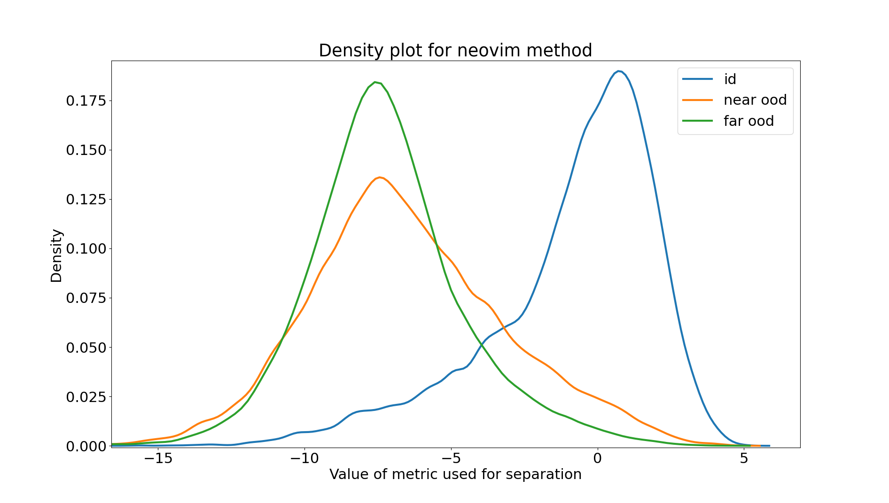
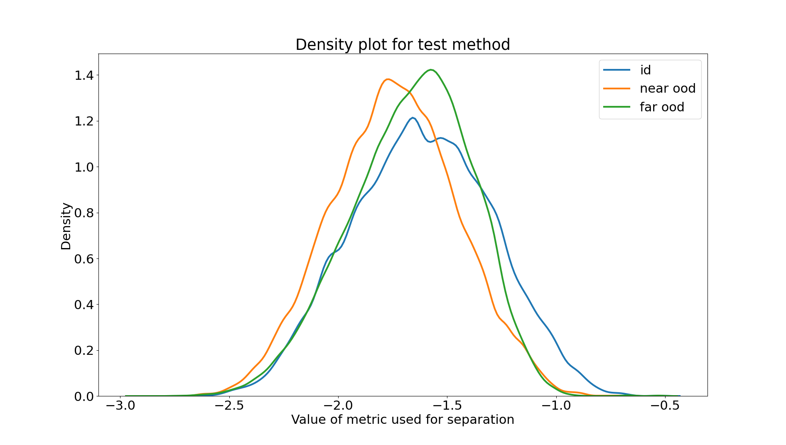
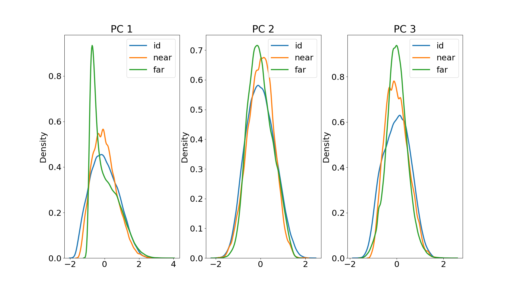
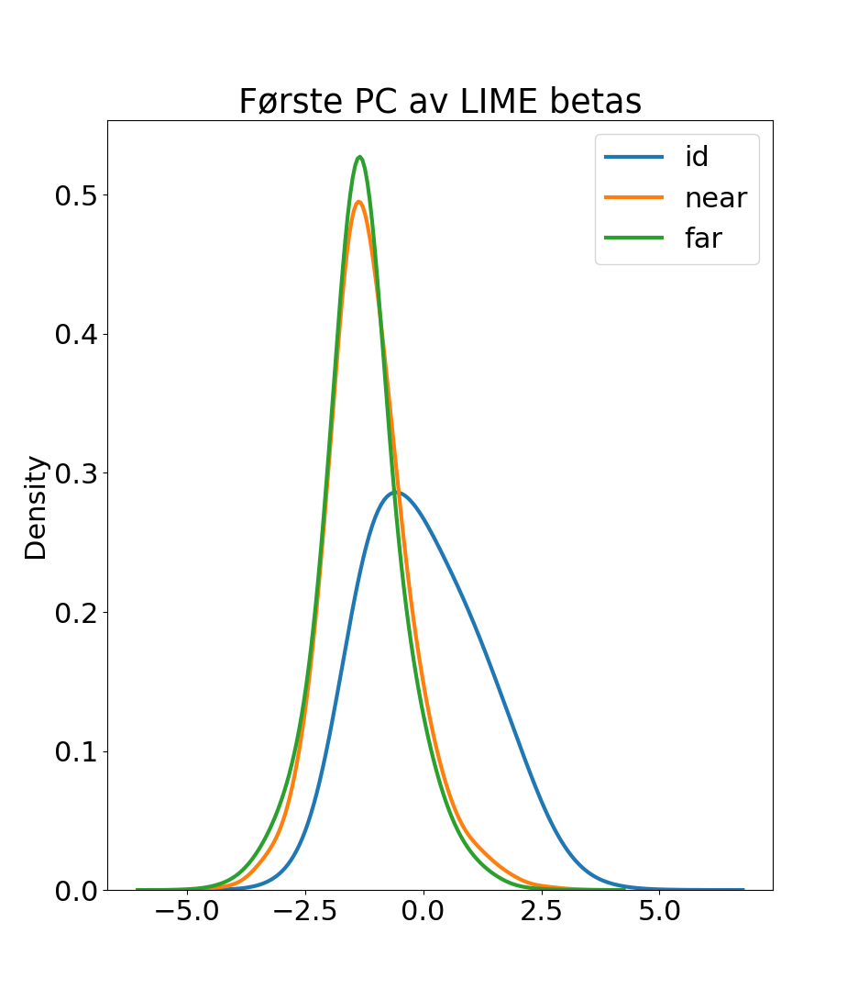
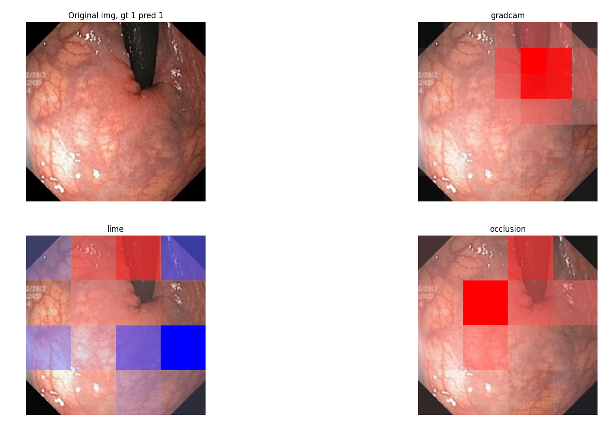

# Uke 36

- [x] Lage val og test set av OpenOOD

# Uke 37

- [x] Implementere NeoViM som OpenOOD postprocessor

- [x] Eksperimentere videre med NeoViM for å se om man kan få bedre performance
- [x] Finne ut om det finnes noen XAI assisterte OOD metoder, skriver related work
- [ ] Finne på nye metoder
    - [ ] Finne på metoder som bygger på allerede eksisterende OOD
    - [ ] Finne på metoder som bare bygger på XAI
- [x] Tenke over muligheten for å ha mange ulike metoder framfor bare én
- [ ] Finne flere XAI metoder, se på hvordan de kunne integreres i OOD

# Uke 38

- [ ] Finne på nye metoder
    - [ ] Finne på metoder som bare bygger på XAI
    - [ ] Noe med LIME? Eller Shapley values?
- [ ] Finne flere XAI metoder, se på hvordan de kunne integreres i OOD
    - [x] Finne flere XAI metoder, se på hvordan de kunne integreres i OOD
    - [x] Se på LIME og Shapley
- [ ] Skriv om LIME og Shapley kanskje
    - [x] Skriv om LIME
- [x] Finne nye metoder
    - CAM clustering

# Uke 39

- [x] Implementer CAM clustering som OpenOOD postprocessor

# Uke 40

- Se på PCA gradcams

- Ganske liten forskjell her, sikkert vanskelig å skille dem

# 41

- Gjør LIME istedenfor gradcam, se på betaene for å skille

# 44

